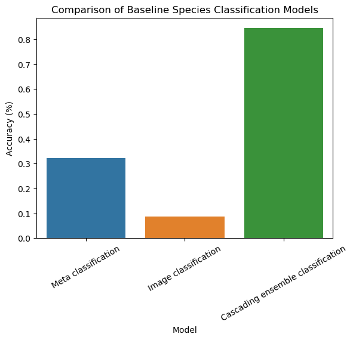

# Spatiotemporal Wildlife Image Classification
Bachelor's thesis investigating **if** and **how** observation **spatiotemporal metadata** can be used to improve 
existing **wildlife image classification** processes. 

# Development
## Environments
All processes make use of a virtual environment to ensure all dependencies are accounted for. 
This project provides alternative possibilities depending on the your needs. 

### Conda Virtual Environment
1. Navigate into your directory root from the terminal
2. Execute the following command: `conda env create -f spatiotemp_class_env.yml`
3. Ensure that whichever IDE you are using, uses the virtual environment to execute any code. 

### Docker Image
A docker image has been made to allow running of the code apart from the image classification training and validation due to the requirement of 
GPUs in that instance. 

Please download the docker image be executing the following command: 
```angular2html
docker pull ghcr.io/trav-d13/spatiotemporal_wildlife_classification/main:latest
```

To execute a file please execute the following command from the terminal (at the root of the project):
```angular2html
docker run -v "$(pwd)":/app -e PYTHONPATH=/app ghcr.io/trav-d13/spatiotemporal_wildlife_classification/main:latest python /app/src/script.py
```

Here is an example to train the metadata models:
```angular2html
 docker run -v "$(pwd)":/app -e PYTHONPATH=/app ghcr.io/trav-d13/spatiotemporal_wildlife_classification/main:latest python /app/src/models/meta/model_training.py
```
Please note, that only upon completed running will the printouts to the terminal be displayed.

### Notebook Environments
This method only works with an already constructed Conda virtual environment. 
Please perform the following steps: 
1. Activate the environment in your terminal
2. Execute the following command to install the required package: `conda install -c anaconda ipykernel`
3. Execute the following command to create the ipykernel: `python -m ipykernel install --user --name=spatiotemp_class_env`
4. In your jupyter notebooks, there will be the new option when selecting the kernel of `spatiotemp_class_env`

This kernel will provide the notebook with access to all dependencies of the virtual environment.

## Data
The dataset is publicly provided and hosted on Kaggle at the following url: [https://www.kaggle.com/datasets/travisdaws/spatiotemporal-wildlife-dataset](https://www.kaggle.com/datasets/travisdaws/spatiotemporal-wildlife-dataset).
Please download the dataset and place it within the `data` directory, so that the project data directory has the following structure:
Please review the Kaggle documentation for more information on the purpose and contents of each directory.

```angular2html
data/
    bonus/
        metadata_mammalia_global.csv
        observations_mammalia_global.csv
    images/
        species_train/
        species_validate/
        taxon_train/
        taxon_validate/
        validation/
    obs_and_meta/
        interim/
        processed/
        raw/
```

You may have to add the `obs_and_meta/interim` directory manually.

## Models
The models used in the novel Cascading Ensemble Classification method are hosted on an Object storage bucket.
Please perform the following steps below to create the correct model directory structure. 
This will enable you to reproduce the Cascading Ensemble Classification Results.

1. Create a `models` directory at the project root. 
2. From the command line, execute the following: `wget https://ce-models.eu-central-1.linodeobjects.com/models.zip`
3. Extract the directories contained within the .zip file into the `models` directory.

The `models` directory should contain the following structure: 
```angular2html
models/
    global/
    image/
    k_clusters/
    meta/
```

The `image`, `k_clusters`, and `meta` directories contain models used by the novel cascading classification method. 
The `global` directory contains the image and metadata flat classification models trained to classify wildlife to the species level. 
These are the baseline models against which the cascading ensemble classifier is compared.

## Metadata Classification
The metadata classification process is located at `src/models/meta/model_training.py`. 
The process is automated to perform all required model training at all taxonomic levels. 
Please review the documentation for more information. 

The training process will make use of as many cores as available on the machine it is training on to 
speed up the training process. 

To analyze and visualize the results, please review `notebooks/meta_modelling/meta_data_model_comparison.ipynb`. 
The data collected during the training process is available in the `notebooks/meta_modelling/model_comparison_cache/` directory.

## Image Classification
The image classification models executes model training and validation from two separate Docker images. 
This allows for easy model training and validation using a GPU unit, on the same image as originally run. 
Any code changes to any of the image classification files do not require the images to be rebuilt as the project directory is 
copied into the container on execution. Any code changes are automatically picked up by the Docker container. 

### Download Docker Images
The docker images are packages in this repository, to download the latest train and validate packages execute the following: 
```angular2html
docker pull docker.pkg.github.com/trav-d13/spatiotemporal_wildlife_classification/image_train:latest
docker pull docker.pkg.github.com/trav-d13/spatiotemporal_wildlife_classification/image_validate:latest
```

### Train New Model
1. Specify the name of the model and the path to the appropriate image directory in `src/models/image/taxonomic_modelling.py`
   - The documentation provides examples. 
2. In the terminal please execute the following command to train the CNN using an available GPU unit.

```angular2html
docker run --gpus all -u $(id -u):$(id -g) -v "$(pwd)":/app/ -w /app -t ghcr.io/trav-d13/spatiotemporal_wildlife_classification/train_image:latest
```
You will see information updating you on the training process printed to terminal/

### Validate New Model
1. Specify the name of the model and the path to the appropriate directory in `src/model/image/evaluate_taxonomic_model.py`. 
   - The documentation provides examples
2. In the terminal please execute the following command to evaluate the CNN model using an available GPU unit
```angular2html
docker run --gpus all -u $(id -u):$(id -g) -v "$(pwd)":/app/ -w /app -t ghcr.io/trav-d13/spatiotemporal_wildlife_classification/validate_image:latest
```
The classification report will be displayed on the terminal. 
Both the image classification report metrics and the model balanced accuracy metric are automatically recorded.

### Analyze and Visualize Image Classification Metrics
Please review the following notebook to analyze and visualize the model results: `notebooks/image_classification/image_classification_visualization.ipynb`. 
The data is saved in the: `notebooks/image_classification/taxon_image_classification_cache/` directory


# Information Summary
Automated wildlife classification is essential within ecological studies, wildlife conservation and management, 
specifically fulfilling the roles of species population estimates, individual identification, and behavioural patterns.

A novel dataset is created combining observations sourced from [iNaturalist](https://www.inaturalist.org/) and metadata 
collected from the open-source historic weather data API at [open-meteo](https://open-meteo.com/). 
The dataset is published and is publicly available at: [https://www.kaggle.com/datasets/travisdaws/spatiotemporal-wildlife-dataset](https://www.kaggle.com/datasets/travisdaws/spatiotemporal-wildlife-dataset).

A novel classification approach combines metadata classification and existing wildlife classification methodologies, within the 
taxonomic hierarchical structure, to accurate classify images down to the subspecies taxonomic level. This methodology
performs at 10 times the accuracy of traditional image classification when classifying wildlife to the species level. 

For more information, please view the website: [https://trav-d13.github.io/spatiotemporal_wildlife_classification/](https://trav-d13.github.io/spatiotemporal_wildlife_classification/).

##### Proposed use-case
A proposed use-case utilizes tourist's public social media postings in order to support wildlife park's population 
estimates and tracking. 
Two considerations are kept in mind. Firstly, this information must be kept confidential in order to eliminate 
the threat of granting poachers additional knowledge. 
Secondly, the immediacy of social media posting and the staggering quantity of historical resources make it 
the largest potential source of wildlife historical and current data.

## Issues in Wildlife Image Classification
#### Modelling 
Image classification relies on labelled images, forming the dataset. 
However, most wildlife image datasets are comprised of images of **varying quality**, and quantity, 
creating **unbalanced** datasets, where some species have very few observations. 
Current wildlife classification processes experience a decreasing classification performance going down 
the taxonomic tree. 

#### Data Subject
The data subject itself, wildlife species, make the classification process difficult, largely due to similar looking 
species, and subspecies, in addition to sympatric species (species found in the same geographic area). 
`
|  |  |
|------------------------------------------------------------|-------------------------------------------------------------------------------|
| Panthera pardus                                            | Panthera Onca                                                                 |`

## Data
The training data is obtained from [iNaturalist](https://www.inaturalist.org/), a citizen-science based platform tasked with generating global research-grade, annotated flora and fauna images to facilitate computer vision developement. 
This thesis focuses exclusively on a subgroup of mammalian families, Elephantidae and Felids. 
The below images serve as sample images from [iNaturalist](https://www.inaturalist.org/)

The link to the used dataset is provided [here](https://www.kaggle.com/datasets/travisdaws/spatiotemporal-wildlife-dataset).
Please review the notebooks available within the dataset, and within the `notebooks/exploratory_data_analysis` directory
for dataset characteristics and EDA.

|  |  |
|---------------------------------------------------------------------------------|---------------------------------------------------------------------------------|
|   |                   |


## Methods
The cascading ensemble classifier capitalizes upon the determined trends within image and metadata classification 
within wildlife's taxonomic structure. 

Specifically: 

- Metadata classification performance increases with decreasing taxonomic level.

- Image classification performance decreases with decreasing taxonomic level. 

The below diagram visualizes the high level concept. 
The concept makes use of a cascading selective classifier (classifier per parent node) for both the image and
metadata classification components, resulting in dual, symmetrical cascading classification trees. 
At each level of the cascade (parent node) the trees communicate, to make a joint decision leveraging or mitigating 
their strengths or weaknesses to form a robust decision. 


## Results
The below figure visualizes the performance comparison of the novel Cascading Ensemble classifier
against baseline traditional image and metadata classifiers. 
For more results on the individual experiments conducted and the discussion regarding the results, 
please review the thesis report. The link can be found in the **[External links](#external-links)** section.



## External Links
Thesis Document: https://trav-d13.github.io/spatiotemporal_wildlife_classification/thesis/
Repository Documentation/ Website: https://trav-d13.github.io/spatiotemporal_wildlife_classification/
Organization Website: https://spatiotemporal-wildlife-classification.github.io/

