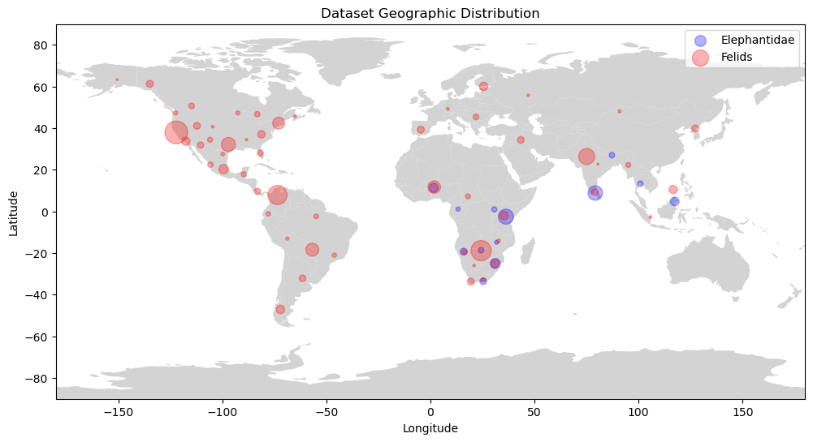

# Dataset

This dataset aimed to provide wildlife observations with a complete set of spatiotemporal metadata, to support the development of 
a novel cascading ensemble classification method. 
Each section below details the relevant essential information regarding the components of the dataset, and the 
final dataset taxonomic count breakdown for observations and images. Note the distinction between observations and images
as observations may contain erroneous or mislabelled images. 

The dataset is published and publicly available at the following link: [https://www.kaggle.com/datasets/travisdaws/spatiotemporal-wildlife-dataset](https://www.kaggle.com/datasets/travisdaws/spatiotemporal-wildlife-dataset)

The below figure displays the geographic distribution of the published dataset:

## Observations
The observations are sourced from [iNaturalist](https://www.inaturalist.org/), a citizen-science platform. 
The images originate from a combination of camera-traps and citizen-science. 
Due to the time and resource limitations of the study, a subset of the available data is utilized, to form a generic subset, 
representative of the issues encountered within wildlife classification. The _Felidae_ and _Elephantidae_ 
mammalian taxonomic families were selected to populate the subset. This is due to the global distribution of the families stretching to
remote corners of the world and the unbalanced number of sightings.

The resulting dataset spans 2 taxonomic families, 16 taxonomic genera, 48 taxonomic species, 
and 67 taxonomic subspecies. 
Note, the common household cat _Felis catus_ was required to be removed from the original dataset, in order to maintain 
a wildlife only dataset.
Additionally, iNaturalist offers the download capability to include the taxonomic labels (domain, kingdom, 
phylum, class, order, family, genus, species, and subspecies). However, the subspecies classification capability became 
apparent late in the study, hence subspecies labels were extracted from observations specifying the subspecies in the place 
of the common name. Hence, a greater quantity of subspecies labels may be available from iNaturalist than within the dataset.

## Image Processing
The raw observation images contained erroneous and mislabelled images, such as images capturing footprints (spoor). 
Additionally, images may have captured multiple wildlife individuals within the same image, with varying quality. 
In order to extract images used to train a wildlife classifier, the raw images are pre-processed using 
[Mega-detector](https://github.com/microsoft/CameraTraps/blob/main/megadetector.md).
Mega-detector is a trained YOLO object detection model, capable of detecting objects from 3 classes (human, vehicle, and wildlife).
The resulting objects, were cropped based on the object detection bounding box, enhanced to maintain resolution, and used as observation 
images.

For in-depth explanation, and visual aids please visit the [Animal-detector](https://github.com/Spatiotemporal-Wildlife-Classification/Animal-Detector)
repository documentation available [here](insert here). The repository contains a working Mega-detector model, and Python scripts performing 
the image cropping and enhancement from the Mega-detector processing.

## Spatiotemporal 
The spatiotemporal data is sourced from [Open-Meteo Weather API](https://open-meteo.com/).
The table below details the set of collected spatiotemporal metadata per observation in order to generate the 
spatiotemporal snapshot. 

For more information on the Open-Meteo Historic API please visit
[Open-Meteo Historic Weather API](https://open-meteo.com/en/docs/historical-weather-api). The table below uses information 
from the API documentation to describe some collected features. 
Additionally, the table details additional information extracted from the 
metadata such as day/ night, light/ dark, terrestrial, etc. 

| Feature                       | Description                                                                                                             | Unit/ Format                              | Timeframe |
|-------------------------------|-------------------------------------------------------------------------------------------------------------------------|-------------------------------------------|-----------|
| Observed on                   | Time of observation                                                                                                     | ISO8601                                   | Instant   |
| Coordinates                   | World Geodetic System (WGS84)                                                                                           | (latitude, longitude)                     | Instant   |
| Positional accuracy           | Publicly available positional accuracy                                                                                  | $R$                                       | Instant   |
| Elevation                     | Meters above sea level                                                                                                  | Meters (m)                                | Instant   |
| Ground temperature (2m)       | Air temperature 2 meters above ground                                                                                   | Celsius ($^{\circ}$ C)                    | Hourly    |
| Relative humidity (2m)        | Humidity 2 meters above ground                                                                                          | Percentage (%)                            | Hourly    |
| Dew point (2m)                | Dew point 2 meters above ground                                                                                         | Celsius ($^{\circ}$ C)                    | Hourly    |
| Apparent temperature          | Real feel temperature considering additional factors                                                                    | Celsius ($^{\circ}$ C)                    | Hourly    |
| Surface pressure              | Atmospheric air pressure at the surface.                                                                                | Hectopascal (hPa)                         | Hourly    |
| Cloudcover                    | Cloudcover within the immediate area                                                                                    | % of area covered                         | Hourly    |
| Low cloudcover                | Cloudcover and fog up to an altitude of $3$ kilometers                                                                  | % of area covered                         | Hourly    |
| Mid cloudcover                | Cloudcover from $3-8$ kilometers altitude                                                                               | % of area covered                         | Hourly    |
| High cloudcover               | Cloudcover from $8$ kilometers altitude                                                                                 | % of area covered                         | Hourly    |
| Wind speed (10m)              | Wind speed at 10 meters above ground                                                                                    | kilometers per hour (km/h)                | Hourly    |
| Wind speed (100m)             | Wind speed at 100 meters above ground                                                                                   | kilometers per hour (km/h)                | Hourly    |
| Wind direction (10m)          | Wind direction at 10 meters above ground                                                                                | Degrees (${\circ}$)                       | Hourly    |
| Wind direction (100m)         | Wind direction at 100 meters above ground                                                                               | Degrees ($\circ$)                         | Hourly    |
| Wind gusts (10m)              | Maximum wind speed of the preceding hour                                                                                | kilometers per hour (km/h)                | Hourly    |
| Shortwave radiation           | Average shortwave solar radiation of the preceding hour                                                                 | Watt per square meter (W/m$^2$)           | Hourly    |
| Direct radiation              | Average direct solar radiation of the preceding hour                                                                    | Watt per square meter (W/m$^2$)           | Hourly    |
| Diffuse radiation             | Average diffuse solar radiation of the preceding hour                                                                   | Watt per square meter (W/m$^2$)           | Hourly    |
| Vapor pressure dificit        | A high VPD effects the transpiration of plants                                                                          | Kilopascal (kPa)                          | Hourly    |
| Evapotranspiration            | Water evaporation into the atmosphere                                                                                   | Millimeters (mm)                          | Hourly    |
| ET0 FAO Evapotranspiration    | Metric estimating required irregation for plants                                                                        | Millimeters (mm)                          | Hourly    |
| Precipitation                 | Hourly precipitation sum (rain, showers, snow)                                                                          | Millimeters (mm)                          | Hourly    |
| Snowfall                      | Hourly snowfall sum                                                                                                     | Centimeters (cm)                          | Hourly    |
| Rain                          | Large scale weather systems resulting rain                                                                              | Millimeters (mm)                          | Hourly    |
| Hourly Weather code           | [WMO](https://www.nodc.noaa.gov/archive/arc0021/0002199/1.1/data/0-data/HTML/WMO-CODE/WMO4677.HTM) numeric weather code | WMO code                                  | Hourly    |
| Soil temperature (0cm-7cm)    | Temperature in the soil at 0-7 centimeters                                                                              | Celsius ($^{\circ}$)                      | Hourly    |
| Soil temperature (7cm-28cm)   | Temperature in the soil at 7-28 centimeters                                                                             | Celsius ($^{\circ}$)                      | Hourly    |
| Soil temperature (28cm-100cm) | Temperature in the soil at 28-100 centimeters                                                                           | Celsius ($^{\circ}$)                      | Hourly    |
| Soil moisture (0cm-7cm)       | Average water content in the soil at 0-7 centimeters                                                                    | Meter cubed per meter cubed (m$^3$/m$^3$) | Hourly    |
| Soil moisture (7cm-28cm)      | Average water content in the soil at 7-28 centimeters                                                                   | Meter cubed per meter cubed (m$^3$/m$^3$) | Hourly    |
| Soil moisture (28cm-100cm)    | Average water content in the soil at 28-100 centimeters                                                                 | Meter cubed per meter cubed (m$^3$/m$^3$) | Hourly    |
| Daily Weather code            | [WMO](https://www.nodc.noaa.gov/archive/arc0021/0002199/1.1/data/0-data/HTML/WMO-CODE/WMO4677.HTM) numeric weather code | WMO code                                  | Daily     |
| Max temperature (2m)          | Maximum daily temperature at 2 meters above ground                                                                      | Degrees ($\circ$)                         | Daily     |
| Min temperature (2m)          | Minimum daily temperature at 2 meters above ground                                                                      | Degrees ($\circ$)                         | Daily     |
| Apparent temperature max      | Maximum real-feel temperature at 2 meters above ground                                                                  | Degrees ($\circ$)                         | Daily     |
| Apparent temperature min      | Minimum real-feel temperature at 2 meters above ground                                                                  | Degrees ($\circ$)                         | Daily     |
| Precipitation sum             | The sum of daily precipitation (rain, showers, snowfall)                                                                | Millimeters (mm)                          | Daily     |
| Rain sum                      | Sum of daily rain                                                                                                       | Millimeters (mm)                          | Daily     |
| Snowfall sum                  | Sum of daily snowfall                                                                                                   | Centimeters (cm)                          | Daily     |
| Precipitation hours           | The number of hours with rain in a day                                                                                  | $Z$                                       | Daily     |
| Sunrise                       | Local sunrise time                                                                                                      | ISO 8601                                  | Daily     |
| Sunset                        | Local sunset time                                                                                                       | ISO 8601                                  | Daily     |
| Wind speed max (10m)          | Maximum daily wind speed 10 meters above ground                                                                         | Kilometers per hour (km/h)                | Daily     |
| Wind gusts (10m)              | Maximum daily gust speed at 10 meters above ground                                                                      | Kilometers per hour                       | Daily     |
| Dominant wind direction       | Dominant daily wind direction for winds at 10 meters                                                                    | Kilometers per hour (km/h)                | Daily     |
| Shortwave radiation sum       | The daily sum of short wave radiation                                                                                   | Megajoules per meter squared (MJ/m$^2$)   | Daily     |
| Daily evapotranspiration      | Sum of daily evapotranspiration                                                                                         | Millimeters (mm)                          | Daily     |
| Terrestrial                   | Terrestrial or aquatic observation                                                                                      | $\{0, 1\}$                                | Instant   |
| Hemisphere                    | Location lies in the northern/ southern hemisphere                                                                      | $\{0, 1\}$                                | Instant   |
| Day                           | Sighting occurrence in light/ dark                                                                                      | $\{0, 1\}$                                | Instant   |
| Season                        | Season of sighting, dependent on hemisphere                                                                             | Season                                    | Instant   |

## Dataset Taxonomic Breakdown

### Taxonomic Family

| Taxonomic Name | Observation Count | Image Count |
|----------------|-------------------|-------------|
| _Felidae_      | 44710             | 26668       |
| _Elephantidae_ | 11292             | 14831       |

### Taxonomic Genus
| Taxonomic Name | Observation Count | Image Count | Family         |
|----------------|-------------------|-------------|----------------|
| _Lynx_         | 20139             | 12121       | _Felidae_      |
| _Panthera_     | 12411             | 7485        | _Felidae_      |
| _Puma_         | 5239              | 2725        | _Felidae_      |
| _Leopardus_    | 2220              | 1391        | _Felidae_      |
| _Acinonyx_     | 1872              | 1245        | _Felidae_      |
| _Felis_        | 991               | 633         | _Felidae_      |
| _Caracal_      | 595               | 323         | _Felidae_      |
| _Herpailurus_  | 448               | 315         | _Felidae_      |
| _Leptailurus_  | 442               | 279         | _Felidae_      |
| _Prionailurus_ | 291               | 124         | _Felidae_      |
| _Neofelis_     | 24                | 11          | _Felidae_      |
| _Otocolobus_   | 20                | 6           | _Felidae_      |
| _Pardofelis_   | 11                | 4           | _Felidae_      |
| _Catopuma_     | 7                 | 4           | _Felidae_      |
| _Loxodonta_    | 9407              | 12810       | _Elephantidae_ |
| _Elephas_      | 1885              | 2021        | _Elephantidae_ |

### Taxonomic Species

| Taxonomic Name             | Observation Count | Image Count | Family         |
|----------------------------|-------------------|-------------|----------------|
| _Lynx rufus_               | 19043             | 11641       | _Felidae_      |
| _Panthera leo_             | 6782              | 4935        | _Felidae_      |
| _Puma concolor_            | 5239              | 2725        | _Felidae_      |
| _Panthera pardus_          | 2964              | 1360        | _Felidae_      |
| _Acinonyx jubatus_         | 1872              | 1245        | _Felidae_      |
| _Panthera onca_            | 1831              | 745         | _Felidae_      |
| _Leopardus pardalis_       | 1324              | 866         | _Felidae_      |
| _Panthera tigris_          | 788               | 433         | _Felidae_      |
| _Lynx canadensis_          | 727               | 355         | _Felidae_      |
| _Caracal caracal_          | 573               | 299         | _Felidae_      |
| _Herpailurus yagouaroundi_ | 448               | 315         | _Felidae_      |
| _Leptailurus serval_       | 442               | 279         | _Felidae_      |
| _Felis lybica_             | 372               | 252         | _Felidae_      |
| _Leopardus weidii_         | 362               | 209         | _Felidae_      |
| _Felis silvestris_         | 345               | 228         | _Felidae_      |
| _Leopardus geoffroyi_      | 288               | 174         | _Felidae_      |
| _Lynx lynx_                | 260               | 75          | _Felidae_      |
| _Felis chaus_              | 228               | 138         | _Felidae_      |
| _Prionailurus bengalensis_ | 178               | 76          | _Felidae_      |
| _Lynx pardinus_            | 109               | 50          | _Felidae_      |
| _Prionailurus javanensis_  | 77                | 31          | _Felidae_      |
| _Leopardus tigrinus_       | 67                | 36          | _Felidae_      |
| _Leopardus guigna_         | 55                | 37          | _Felidae_      |
| _Leopardus guttulus_       | 47                | 33          | _Felidae_      |
| _Panthera uncia_           | 46                | 12          | _Felidae_      |
| _Caracal aurata_           | 22                | 24          | _Felidae_      |
| _Otocolombus manul_        | 20                | 6           | _Felidae_      |
| _Neofelis diardi_          | 19                | 8           | _Felidae_      |
| _Felis nigripes_           | 17                | 4           | _Felidae_      |
| _Prionailurus viverrinus_  | 17                | 9           | _Felidae_      |
| _Leopardus pajeros_        | 16                | 10          | _Felidae_      |
| _Leopardus colocola_       | 16                | 7           | _Felidae_      |
| _Leopardus garleppi_       | 12                | 6           | _Felidae_      |
| _Prionailurus rubiginosus_ | 12                | 5           | _Felidae_      |
| _Pardofelis marmorata_     | 11                | 3           | _Felidae_      |
| _Leopardus emiliae_        | 10                | 5           | _Felidae_      |
| _Felis margarita_          | 10                | 1           | _Felidae_      |
| _Leopardus braccatus_      | 9                 | 5           | _Felidae_      |
| _Leopardus jacobita_       | 7                 | 2           | _Felidae_      |
| _Prionailurus planiceps_   | 7                 | 3           | _Felidae_      |
| _Catopuma temminckii_      | 6                 | 2           | _Felidae_      |
| _Neofelis nebulosa_        | 5                 | 2           | _Felidae_      |
| _Felis bieti_              | 4                 | 0           | _Felidae_      |
| _Leopardus fasciatus_      | 2                 | 0           | _Felidae_      |
| _Catopuma badia_           | 1                 | 0           | _Felidae_      |
| _Loxodonta africana_       | 8939              | 12313       | _Elephantidae_ |
| _Elephas maximus_          | 1885              | 2021        | _Elephantidae_ |
| _Loxodonta cyclotis_       | 222               | 214         | _Elephantidae_ |

### Taxonomic Subspecies

| Taxonomic Name                         | Observation Count | Image Count | Family         |
|----------------------------------------|-------------------|-------------|----------------|
| _Panthera leo melanochaita_            | 5587              | 4035        | _Felidae_      |
| _Panthera pardus pardus_               | 2449              | 1160        | _Felidae_      |
| _Acinonyx jubatus jubatus_             | 1642              | 1079        | _Felidae_      |
| _Panthera leo leo_                     | 786               | 672         | _Felidae_      |
| _Panthera tigris tigris_               | 710               | 430         | _Felidae_      |
| _Lynx rufus fasciatus_                 | 410               | 263         | _Felidae_      |
| _Puma concolor couguar_                | 357               | 172         | _Felidae_      |
| _Caracal caracal caracal_              | 349               | 163         | _Felidae_      |
| _Lynx rufus rufus_                     | 262               | 163         | _Felidae_      |
| _Panthera pardus fusca_                | 222               | 107         | _Felidae_      |
| _Puma concolor concolor_               | 167               | 99          | _Felidae_      |
| _Felis lybica cafra_                   | 167               | 112         | _Felidae_      |
| _Panthera pardus kotiya_               | 164               | 77          | _Felidae_      |
| _Leptailurus serval lipostictus_       | 152               | 96          | _Felidae_      |
| _Felis silvestris silvestris_          | 144               | 98          | _Felidae_      |
| _Felis chaus affinis_                  | 105               | 69          | _Felidae_      |
| _Leptailurus serval serval_            | 87                | 54          | _Felidae_      |
| _Felis lybica lybica_                  | 81                | 74          | _Felidae_      |
| _Leopardus pardalis mitis_             | 58                | 44          | _Felidae_      |
| _Leptailurus serval constantina_       | 57                | 46          | _Felidae_      |
| _Acinonyx jubatus hecki_               | 46                | 37          | _Felidae_      |
| _Prionailurus javanensis sumatranus_   | 38                | 16          | _Felidae_      |
| _Prionailurus bengalensis euptilurus_  | 32                | 16          | _Felidae_      |
| _Lynx rufus escuinapae_                | 27                | 16          | _Felidae_      |
| _Felis lybica ornata_                  | 26                | 16          | _Felidae_      |
| _Prionailurus bengalensis bengalensis_ | 22                | 13          | _Felidae_      |
| _Neofelis diardi borneensis_           | 16                | 8           | _Felidae_      |
| _Panthera tigris sondaica_             | 15                | 0           | _Felidae_      |
| _Panthera pardus delacouri_            | 15                | 10          | _Felidae_      |
| _Lynx lynx lynx_                       | 14                | 6           | _Felidae_      |
| _Leopardus guigna guigna_              | 13                | 9           | _Felidae_      |
| _Leopardus pardalis pardalis_          | 11                | 8           | _Felidae_      |
| _Panthera pardus tulliana_             | 11                | 5           | _Felidae_      |
| _Panthera tigris altaica_              | 11                | 0           | _Felidae_      |
| _Panthera pardus melas_                | 10                | 1           | _Felidae_      |
| _Caracal caracal nubicus_              | 10                | 9           | _Felidae_      |
| _Felis silvestris caucasica_           | 9                 | 7           | _Felidae_      |
| _Prionailurus javanensis javanensis_   | 8                 | 1           | _Felidae_      |
| _Prionailurus viverrinus viverrinus_   | 8                 | 5           | _Felidae_      |
| _Lynx lynx dinniki_                    | 8                 | 7           | _Felidae_      |
| _Leopardus guigna tigrillo_            | 5                 | 4           | _Felidae_      |
| _Lynx lynx isabellinus_                | 5                 | 0           | _Felidae_      |
| _Lynx lynx carpathicus_                | 5                 | 4           | _Felidae_      |
| _Leopardus tigrinus oncilla_           | 4                 | 0           | _Felidae_      |
| _Pardofelis marmorata marmorata_       | 4                 | 2           | _Felidae_      |
| _Elephas maximus indicus_              | 877               | 920         | _Elephantidae_ |
| _Elephas maximus maximus_              | 567               | 740         | _Elephantidae_ |
| _Elephas maximus borneensis_           | 180               | 146         | _Elephantidae_ |
| _Elephas maximus sumatranus_           | 18                | 12          | _Elephantidae_ |
