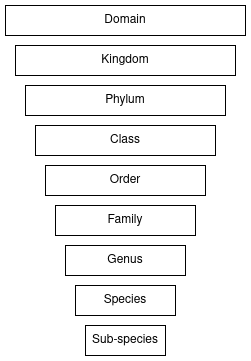
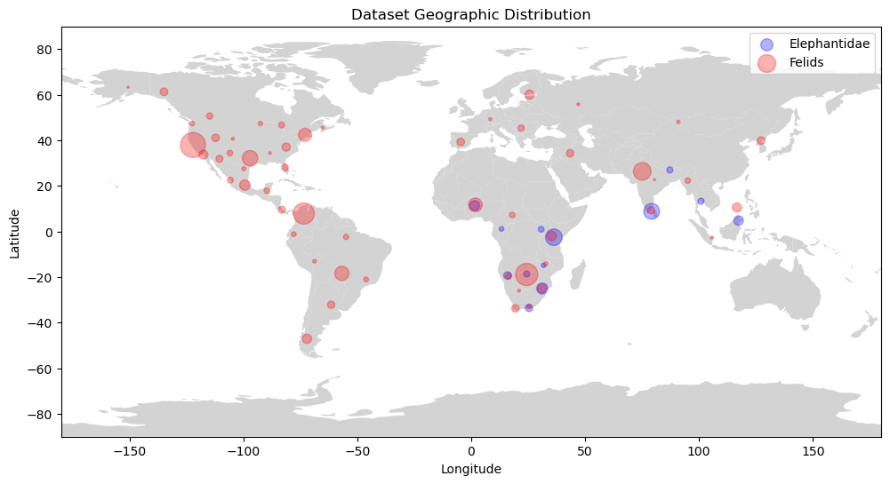
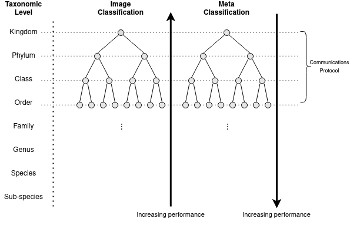

# Bolstering Wildlife Classification Using Spatiotemporal Metadata

### Introduction
The global extent of social media, camera traps, and citizen science has the potential to provide 
a real-time global wildlife overview reaching to the furthest corners of the globe.

Automated wildlife classification is essential within ecological studies, wildlife conservation and management, 
specifically fulfilling the roles of species population estimates, individual identification, and behavioural patterns.
However, due to the harsh environments, variable image quality, and long-tail data distribution, traditional 
wildlife classification methods struggle to achieve top performance. 

Existing studies have successfully used metadata to boost the performance of image classification. 
Additionally, the taxonomic structure of metadata falls into the cascading classifier domain. 
The findings of previous studies, lead to the investigation of how taxonomic levels influence the performance 
of metadata and image classification models. Further, how can the determined trends be leveraged within a novel 
cascading ensemble classifier utilizing both metadata and image classification components to improve upon traditional 
methods.

The proposed research questions include:

1. How does taxonomic level influence the performance of metadata classification?
2. How does taxonomic level influence the performance of image classification?
3. How does the novel cascading ensemble method improve upon baseline classifiers?

The novel contributions of this study include:

- The collection and generation of a new dataset containing both labelled images and accurate metadata.
- A study of metadata based models through the taxonomic levels.
- A novel taxonomic tree structured cascading ensemble classifier.

### Dataset
For a comprehensive breakdown of the dataset including taxonomic observation and image counts, please
review [Dataset](dataset.md)

The dataset comprises two elements: the original observations sourced from iNaturalist, and the metadata sourced from 
Open-Meteo Weather API.

#### iNaturalist
[iNaturalist](https://www.inaturalist.org/) is a citizen-science platform offering open-source access to up to 139 million
observations accross all domains of life. 

For the purpose of this study, a subset of the available wildlife, specifically _Felidae_ and _Elephantidae_ taxonomic families.
The subset contains global observations stretching across the globe and is characterized by a long-tail distribution, fulfilling
the role of a generic wildlife dataset.

iNaturalist observations include essential metadata such as: date and time of observation, coordinates, positional accuracy, and
taxonomic labels.

Below are two example images and their taxonomic species name:

|  |  |
|------------------------------------------------------------|-------------------------------------------------------------------------------|
| Panthera pardus                                            | Panthera Onca                                                                 |

#### Open-Meteo
[Open-Meteo Weather API](https://open-meteo.com/) grants historical weather data access. The API sources 
data directly from [Copernicus Satellite imagery ERA5](https://cds.climate.copernicus.eu/cdsapp#!/dataset/reanalysis-era5-land?tab=overview). 
The weather data enables the creation of a spatiotemporal environmental snapshot of the observation, through the specification 
of the date, time, and location of the observation. 
The snapshot comprises of hourly and daily aggregate information, capturing a set of 53 total environmental descriptors.

#### Resulting Dataset
The figure below describes the _Felidae_ and _Elephantidae_ geographic distribution within the dataset:

The resulting dataset encompasses approximately 50 000 observations with metadata.
The taxonomic composition of the dataset is as follows: 2 taxonomic families, 16 taxonomic genera, 
48 taxonomic species, and 67 taxonomic subspecies. 
For a complete taxonomic breakdown of the number of observations and images, please review [Dataset](dataset.md)

### Novel Cascading Ensemble Classifier
For a comprehensive breakdown of the novel cascading ensemble classifier, please review 
[Cascading Ensemble Classifier](cascading_ensemble_classifier.md)

The novel cascading ensemble classifier capitalizes upon the determined performance trends of image and metadata classification 
within the taxonomic hierarchy. 
Specifically, the decreasing performance of image classification as taxonomic levels decrease, and the increasing 
performance of metadata classification as taxonomic species decrease. 
The image and metadata classifiers respectively comprise of a cascading selective classifier (classification per parent node). 
At each parent node, the classifications are combined and weighted based to exploit their relative strengths, jointly deciding 
on the correct classification. 

The below figure represents the high level concept of the classifier:

### Results
For a comprehensive breakdown of each experiment, the results, and the final discussion, 
please review [Results](results.md)

The study, investigated three proposed research questions: 

1. How does taxonomic level influence the performance of metadata classification?

2. How does taxonomic level influence the performance of image classification?

3. How does the proposed novel classification method improve upon baseline classifiers?

The study determined the following in response to the research questions: 

1. Metadata classifier performance increases with decreasing taxonomic level, showcasing a nearly 92% balanced accuracy at the subspecies taxonomy.

2. Image classification performance decreases with decreasing taxonomic level, showcasing a nearly 85% balanced accuracy at the genus taxonomy. 

3. The novel ensemble classifier outperforms baseline image classification models by 20 times. 

Please review the [thesis report](thesis.md) for full insight into the study. 
