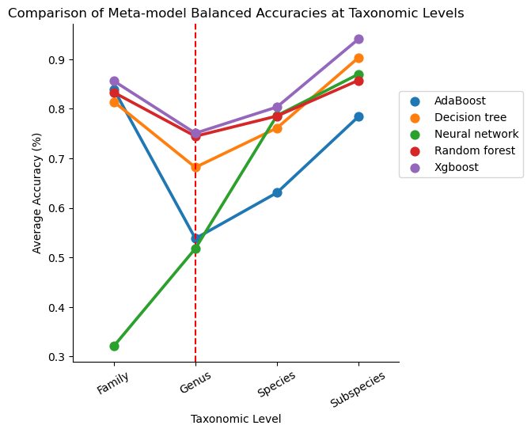
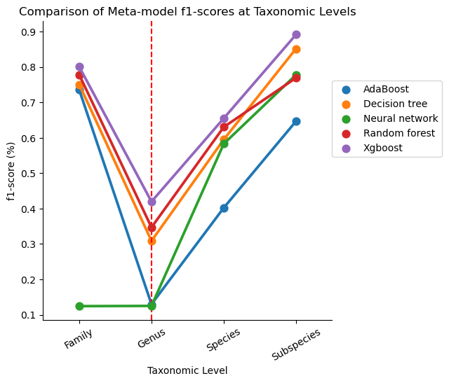
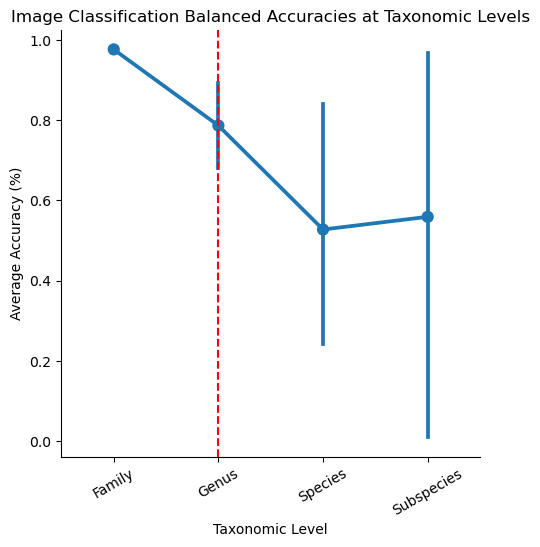
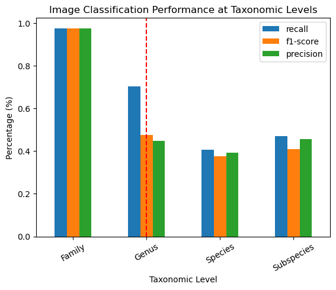

# Results
This page is to serve as a summary of the key results of the study. 
Please review the Thesis report for extensive information regarding the study. 

## Research Questions
The proposed research questions for this study include: 

1. How does taxonomic level influence the performance of metadata classification?
2. How does taxonomic level influence the performance of image classification?
3. How does the novel cascading ensemble method improve upon baseline classifiers?

## Experiments
The set of experiments conducted within this study revolve around determining the performance of metadata and image classification models within the taxonomic structure,
to determine taxonomic performance trends. 
Additionally, to evaluate and compare the resulting CE classification within the taxonomic structure and against baseline classification
performances. 

Please review the Thesis Report for the complete experiment, result, discussion, and conclusion.

## Results
Please note, the inclusion of the red vertical line at the Genus taxonomy indicates that from that point on the results
are expected to be accurate. This is as the family taxon results are mis-representative of the expected results, 
due to the inclusion of only two familie, _Felidae_ and _Elephantidae_.

### Taxonomic Metadata Classifier Performance Trend and Model Comparison
The below figure visualizes the mean balanced accuracy performance of each metadata model type. 
The figure captures an almost linear increasing trend in all metadata models as taxon level decreases from genus to subspecies. 
Note, the species and subspecies perform at balanced accuracies of 80%-95%. 
Notably, the XGBoost model outperformed all others at all taxonomic levels in terms of mean balanced accuracy. 

The below figure shows a similar trend in the model's f1-scores. The XGBoost model remains the highest performing metadata classifier, 
across both metrics and all models of comparison.

### Taxonomic Image Classification Trend
The below figure visualizes the mean balanced accuracy of the image classification model at each taxonomic level. 
The figure showcases a decreasing linear trend in classification performance as taxon level decreases. An opposite relationship 
to that discovered from metadata classification.
However, there seems to be an increase at the subspecies taxonomy. 
The bars represent the percentile interval for each taxonomic level, showing the 95% confidence interval of where the data falls. 
The percentile intervals increase with decreasing taxonomic depth, with the subspecies taxonomy having the largest percentile interval. 

The below figure showcases a similar decreasing trend across the precision, recall, and f1-score performance metrics. 

